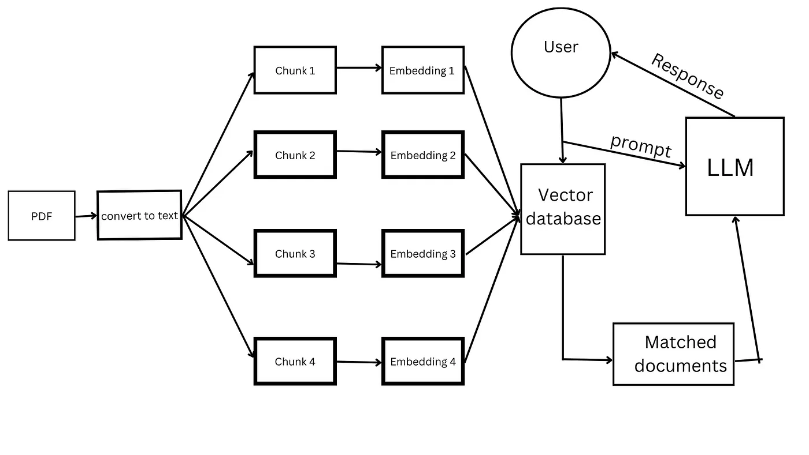

## Chatting with your PDFs using Mistral7b LLM and langchain with pinecone vector database

Architecture

To run this 
* Create a huggingface account and add your API Key in a `.env` file \n
* Create a Pinecone account and add pinecone api key and api_env in `.env` file
```python
pip install -r requirements.txt
streamlit run app.py
```
